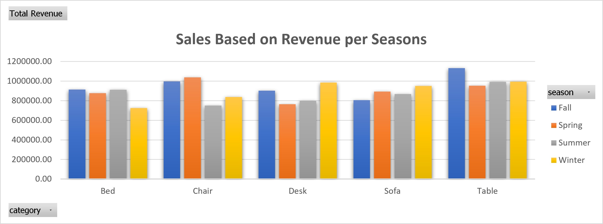

# Furniture-Sales-Performance-Analysis

A data-driven analysis of furniture export performance, covering seasonal demand patterns, category profitability, and inventory optimization strategies.

---

### 📊 Download Project Files
* 📄 [Download Complete Excel Workbook (.xlsx)](https://github.com/Deneiraintan/Furniture-Sales-Performance-Analysis/raw/main/Furniture.csv.xlsx)
---

## 1. Project Overview
This project focuses on conducting a comprehensive analysis of furniture export data to uncover operational trends and market performance. By leveraging a multi-dimensional dataset, I examined sales performance across different product categories and seasonal fluctuations to provide a data-driven overview of the company's export health.

## 2. Tools & Methodology
* **Microsoft Excel:** Used for deep-dive data manipulation, cleaning, and aggregation.
* **Power Query:** Utilized to eliminate duplicates, handle missing records, and normalize data anomalies.
* **Advanced Formulas & Analytics:** Leveraged XLOOKUP, SUMIFS, and nested logical functions alongside dynamic **Pivot Tables** to segment sales by calendar quarters and regions.
* **Data Visualization:** Built an interactive dynamic dashboard using charts and slicers to enable quick multi-axis management reviews.

### Dashboard Preview

## 3. Problem Statement
In the competitive furniture export industry, identifying growth opportunities and operational bottlenecks is critical. The company faced challenges in understanding how seasonal shifts impact product demand and profitability. This analysis was initiated to transition from anecdotal decision-making to a data-backed strategy, specifically to identify high-performing categories and optimize inventory levels to align with seasonal market demand.

## 4. Key Findings
* **Seasonal Demand Variance:** The data reveals clear seasonality, with specific categories peaking in distinct quarters. For instance, Desks show a significant revenue spike during Winter, while Chairs perform best during the Spring season.
* **Profitability Patterns:** By filtering and normalizing the data (addressing anomalies in revenue entries), the analysis provides an accurate reflection of net profitability, showing consistent margins across core product categories.
* **Operational Insights:** The analysis highlights how seasonal demand shifts directly influence revenue, confirming the need for a dynamic approach to inventory management.

## 5. Business Recommendations
* **Seasonal Inventory Optimization:** Implement a proactive stock-replenishment strategy. Increase inventory capacity for Desks by Q4 and Chairs by Q1 to capitalize on peak demand without overstocking during off-seasons.
* **Targeted Regional Marketing:** Align promotional activities and marketing budgets with the identified peak seasons for each product category to maximize return on effort.
* **Dynamic Planning:** Utilize these seasonal trends to forecast future demand, allowing for more precise production scheduling and cost-effective distribution.
